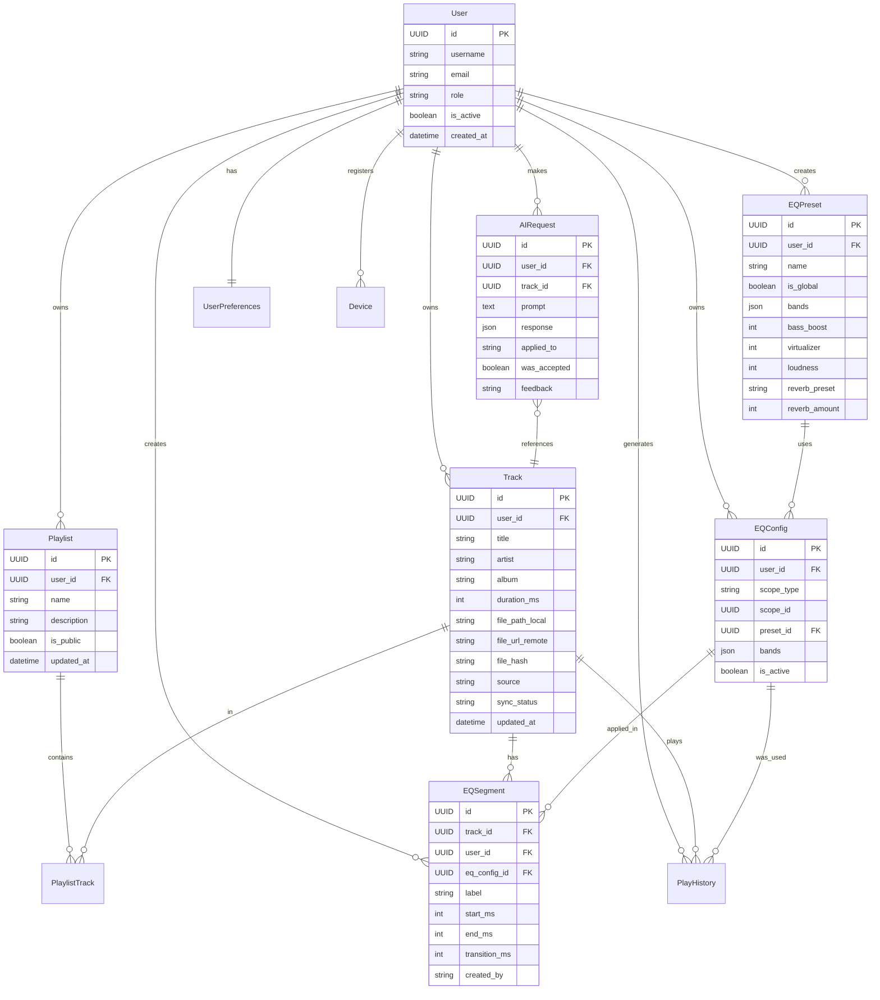

# 🎵 MusicFlow — Scrum & Technical Specification

> **Documento maestro del proyecto** — Product Backlog, Roadmap de Sprints, Arquitectura y Modelo de Datos.
> **Versión:** 2.0
> **Fecha:** Abril 2026
> **Rol:** Scrum Master + Full Stack Architect

---

## 📑 Tabla de Contenidos

1. [Visión del Producto](https://claude.ai/chat/447945ae-068f-4233-9a4b-f3d9f1a8d385#1-visi%C3%B3n-del-producto)
2. [Objetivos SMART](https://claude.ai/chat/447945ae-068f-4233-9a4b-f3d9f1a8d385#2-objetivos-smart)
3. [Stakeholders y Roles](https://claude.ai/chat/447945ae-068f-4233-9a4b-f3d9f1a8d385#3-stakeholders-y-roles)
4. [Stack Tecnológico](https://claude.ai/chat/447945ae-068f-4233-9a4b-f3d9f1a8d385#4-stack-tecnol%C3%B3gico)
5. [Arquitectura General](https://claude.ai/chat/447945ae-068f-4233-9a4b-f3d9f1a8d385#5-arquitectura-general)
6. [Modelo de Datos Completo](https://claude.ai/chat/447945ae-068f-4233-9a4b-f3d9f1a8d385#6-modelo-de-datos-completo)
7. [Épicas del Producto](https://claude.ai/chat/447945ae-068f-4233-9a4b-f3d9f1a8d385#7-%C3%A9picas-del-producto)
8. [Product Backlog Detallado](https://claude.ai/chat/447945ae-068f-4233-9a4b-f3d9f1a8d385#8-product-backlog-detallado)
9. [Roadmap de Sprints](https://claude.ai/chat/447945ae-068f-4233-9a4b-f3d9f1a8d385#9-roadmap-de-sprints)
10. [Definition of Ready / Done](https://claude.ai/chat/447945ae-068f-4233-9a4b-f3d9f1a8d385#10-definition-of-ready--done)
11. [Ceremonias Scrum](https://claude.ai/chat/447945ae-068f-4233-9a4b-f3d9f1a8d385#11-ceremonias-scrum)
12. [Métricas y KPIs](https://claude.ai/chat/447945ae-068f-4233-9a4b-f3d9f1a8d385#12-m%C3%A9tricas-y-kpis)
13. [Gestión de Riesgos](https://claude.ai/chat/447945ae-068f-4233-9a4b-f3d9f1a8d385#13-gesti%C3%B3n-de-riesgos)

---

## 1. Visión del Producto

**MusicFlow** es una plataforma multiplataforma (Desktop + Mobile) de reproducción musical enfocada en la **personalización granular de la ecualización** asistida por un  **agente de inteligencia artificial** .

### Propuesta de Valor Única

> *"El primer reproductor que entiende tu música a nivel de segundo. Ecualiza el coro distinto al puente, cada canción distinto al resto, cada playlist con su propia personalidad — todo manualmente o pidiéndoselo a una IA en lenguaje natural."*

### Diferenciadores Clave

| Característica                                | MusicFlow | Competencia (Spotify, Poweramp, etc.) |
| ---------------------------------------------- | --------- | ------------------------------------- |
| EQ global                                      | ✅        | ✅                                    |
| EQ por playlist                                | ✅        | ❌                                    |
| EQ por canción                                | ✅        | Parcial                               |
| **EQ por segmento temporal**             | ✅        | ❌                                    |
| **Agente IA para configurar EQ**         | ✅        | ❌                                    |
| Modo híbrido (local + cloud)                  | ✅        | Parcial                               |
| **Disponible en Web + Desktop + Mobile** | ✅        | Parcial                               |

### 🌐 Disponibilidad Multiplataforma

MusicFlow se distribuye en **3 formatos** con un código base compartido al máximo:

1. **🌐 Web (PWA)** — Accesible desde cualquier navegador en `app.musicflow.com`. Instalable como PWA. Ideal para prueba rápida y uso ocasional.
2. **🖥️ Desktop (Electron)** — Aplicación nativa para Windows, macOS y Linux con acceso completo al sistema de archivos, widgets, atajos globales y mejor rendimiento.
3. **📱 Mobile (Flutter)** — App nativa para Android e iOS con features específicas de móvil (widgets, Android Auto, CarPlay, background playback optimizado).

> La versión **web y desktop comparten el 95% del código** (React + TypeScript). Solo cambia la capa de acceso al sistema (archivos, DB local, notificaciones) mediante una abstracción.

### Mercado Objetivo

* **Primario:** Audiófilos y entusiastas de la música (18-45 años) que valoran la calidad de audio.
* **Secundario:** Usuarios casuales que quieren una experiencia sonora mejorada sin conocimientos técnicos (uso del agente IA).
* **Terciario:** Productores y DJs que buscan herramientas de personalización rápida.

---

## 2. Objetivos SMART

| #  | Objetivo                                                         | Métrica                                    | Plazo     |
| -- | ---------------------------------------------------------------- | ------------------------------------------- | --------- |
| O1 | Lanzar MVP con EQ multi-nivel funcional en desktop y mobile      | App publicada en stores y descargable       | Sprint 7  |
| O2 | Implementar agente IA con ≥85% de satisfacción de usuario      | Feedback `good`/`total`en `AIRequest` | Sprint 8  |
| O3 | Lograr sincronización híbrida confiable con ≤2% de conflictos | Logs de sync exitosos                       | Sprint 9  |
| O4 | Cubrir ≥80% del código backend con tests automatizados         | Coverage report                             | Sprint 10 |
| O5 | Alcanzar tiempo de carga de biblioteca <3s para 1000 tracks      | Benchmark de performance                    | Sprint 10 |

---

## 3. Stakeholders y Roles

### Equipo Scrum

| Rol                                  | Responsabilidad                                      | Cantidad      |
| ------------------------------------ | ---------------------------------------------------- | ------------- |
| **Product Owner**              | Prioriza backlog, define visión, valida entregables | 1             |
| **Scrum Master**               | Facilita ceremonias, elimina bloqueos                | 1             |
| **Backend Developer**          | Django, DRF, PostgreSQL, Celery, integración IA     | 2             |
| **Frontend Desktop Developer** | Electron + React (admin + cliente)                   | 2             |
| **Mobile Developer**           | Flutter (cliente)                                    | 1-2           |
| **UX/UI Designer**             | Diseño de interfaces, wireframes, prototipos        | 1             |
| **QA Engineer**                | Testing manual y automatizado                        | 1             |
| **DevOps**                     | CI/CD, infraestructura, monitoreo                    | 1 (part-time) |

### Stakeholders Externos

* Usuarios finales (beta testers)
* Inversionistas / sponsors del proyecto
* Proveedores: Anthropic (Claude API), proveedor de cloud (AWS/GCP)

---

## 4. Stack Tecnológico

### 🔵 Backend

```yaml
Framework: Django 5.x + Django REST Framework 3.x
Lenguaje: Python 3.12+
Base de datos: PostgreSQL 16
Cache / Broker: Redis 7
Task Queue: Celery 5
Auth: djangorestframework-simplejwt (JWT)
Storage: AWS S3 / MinIO (archivos de audio)
WebSockets: Django Channels (opcional, para sync en tiempo real)
IA: Claude API (Anthropic) vía anthropic SDK
Audio metadata: mutagen
Testing: pytest, pytest-django, factory_boy
```

### 🟢 Frontend Web + Desktop (React + Electron)

> **Estrategia dual:** el mismo código React se despliega como **aplicación web** (navegador) y se empaqueta con **Electron** para Windows, macOS y Linux. Se usa una capa de abstracción para acceder a capacidades específicas de cada entorno.

```yaml
# Código compartido (web + desktop)
Framework: React 19 + TypeScript 5
Bundler: Vite
Estado: Zustand
Routing: React Router 6
UI: TailwindCSS + shadcn/ui
Cliente HTTP: TanStack Query + Axios
Audio: Web Audio API (ecualización en tiempo real)
Testing: Vitest + React Testing Library + Playwright (E2E)

# Específico Desktop
Shell: Electron 30+
DB local: SQLite (vía better-sqlite3) con IPC
File System: Node.js fs (acceso completo)
Auto-updater: electron-updater
Build: electron-builder

# Específico Web
PWA: Workbox (service workers para offline parcial)
DB local: IndexedDB con Dexie.js
File System: File System Access API (donde disponible)
Deployment: Nginx + CDN (Cloudflare)
Hosting sugerido: Vercel, Netlify o VPS propio
```

### 🔀 Estrategia Multi-Target

```typescript
// src/shared/platform/detector.ts
export const platform = {
  isElectron: typeof window !== 'undefined' && !!window.electronAPI,
  isWeb: typeof window !== 'undefined' && !window.electronAPI,
  isPWAInstalled: window.matchMedia('(display-mode: standalone)').matches,
};

// src/shared/services/localDB.ts - Abstracción
export interface LocalDB {
  getTrack(id: string): Promise<Track | null>;
  saveTrack(track: Track): Promise<void>;
  // ...
}

export const localDB: LocalDB = platform.isElectron
  ? new ElectronSQLiteDB()
  : new WebIndexedDB();
```

### 🟣 Frontend Mobile (Flutter)

```yaml
Framework: Flutter 3.22+ / Dart 3.4+
Estado: Riverpod 2.x
Audio: just_audio + audio_service
EQ: plugin nativo custom (Android AudioEffects / iOS AVAudioUnitEQ)
HTTP: Dio
DB local: Drift (SQLite)
Almacenamiento clave-valor: Hive
Testing: flutter_test + integration_test
```

### 🛠️ DevOps e Infraestructura

```yaml
Contenedores: Docker + Docker Compose
Orquestación: Kubernetes (producción) o Docker Swarm (staging)
CI/CD: GitHub Actions
Monitoreo: Sentry (errores) + Grafana + Prometheus (métricas)
Logs: ELK Stack o Loki
Reverse Proxy: Nginx
Dominio / CDN: Cloudflare
```

---

## 5. Arquitectura General

### 5.1 Diagrama de Componentes

```
┌─────────────────────────────────────────────────────────────────────────┐
│                            CAPA CLIENTE                                 │
│                                                                         │
│  ┌─────────────────────────────────────────┐  ┌───────────────┐         │
│  │     REACT + TYPESCRIPT (mismo código)   │  │    Flutter    │         │
│  │                                         │  │    CLIENTE    │         │
│  │  ┌───────────────┐  ┌────────────────┐  │  │   (Mobile)    │         │
│  │  │   WEB (PWA)   │  │   DESKTOP      │  │  │               │         │
│  │  │   navegador   │  │  (Electron)    │  │  │ Android / iOS │         │
│  │  │               │  │                │  │  │               │         │
│  │  │ Admin+Cliente │  │ Admin+Cliente  │  │  │ Solo Cliente  │         │
│  │  │               │  │                │  │  │               │         │
│  │  │  IndexedDB    │  │  SQLite nativo │  │  │  Drift (SQL)  │         │
│  │  └───────────────┘  └────────────────┘  │  └───────┬───────┘         │
│  │     Deployment:        Deployment:      │          │                 │
│  │  Vercel/Nginx+CDN   electron-builder    │          │                 │
│  │                     (.exe, .dmg, .deb)  │          │                 │
│  └──────────────────┬──────────────────────┘          │                 │
│                     │                                 │                 │
└─────────────────────┼─────────────────────────────────┼─────────────────┘
                      │     HTTPS / JWT                 │
                      └────────────────┬────────────────┘
                                       │
┌──────────────────────────────────────▼─────────────────────────┐
│                        CAPA BACKEND                            │
│                                                                │
│  ┌────────────────────────────────────────────────────────────┐│
│  │             Django REST API (Gunicorn + Nginx)             ││
│  │  ┌──────────┐ ┌──────────┐ ┌──────────┐ ┌──────────────┐   ││
│  │  │   Auth   │ │ Library  │ │    EQ    │ │  AI Agent    │   ││
│  │  │  Module  │ │  Module  │ │  Module  │ │   Module     │   ││
│  │  └──────────┘ └──────────┘ └──────────┘ └──────────────┘   ││
│  │  ┌──────────┐ ┌──────────┐ ┌──────────┐ ┌──────────────┐   ││
│  │  │   Sync   │ │Analytics │ │  Admin   │ │ Notifications│   ││
│  │  └──────────┘ └──────────┘ └──────────┘ └──────────────┘   ││
│  └────────────────────────────────────────────────────────────┘│
│        │              │                │                │      │
│        ▼              ▼                ▼                ▼      │
│  ┌──────────┐ ┌──────────────┐ ┌──────────┐ ┌───────────────┐  │
│  │PostgreSQL│ │  Redis Cache │ │  Celery  │ │   S3/MinIO    │  │
│  │          │ │   + Broker   │ │  Workers │ │(archivos audio│  │
│  └──────────┘ └──────────────┘ └────┬─────┘ └───────────────┘  │
│                                     │                          │
│                                     ▼                          │
│                              ┌────────────┐                    │
│                              │ Claude API │                    │
│                              │ (Anthropic)│                    │
│                              └────────────┘                    │
└────────────────────────────────────────────────────────────────┘
```

### 5.2 Flujo de Datos Clave — Agente IA

```
Usuario: "Quiero más bajos en el coro del minuto 1:30 al 2:10"
   │
   ▼
Cliente (React/Flutter) → POST /api/ai/eq-suggest
   │ {prompt, track_id, current_eq, context}
   ▼
Django View (AIAgentView)
   │
   ├─► Construye prompt enriquecido (contexto de canción, género, EQ actual)
   │
   ▼
Claude API (función específica: generate_eq_config)
   │ Respuesta JSON estructurada:
   │ { "bands": [-2, 0, 3, 5, 4, 2, 0, 0, 0, 0], "segment": {"start": 90000, "end": 130000}, "explanation": "..." }
   ▼
Parser + Validador (Pydantic schema)
   │
   ├─► Guarda AIRequest en DB
   ├─► Crea/actualiza EQSegment
   │
   ▼
Respuesta al cliente con preview aplicable
   │
   ▼
Usuario acepta/rechaza → feedback loop
```

### 5.3 Estrategia de Sincronización Híbrida

1. **Los archivos de audio** pueden vivir:
   * Solo locales (`source=local`)
   * Solo en servidor (`source=synced`)
   * En ambos lados (`source=both`)
2. **La metadata y configuraciones EQ** SIEMPRE viven en el servidor + caché local (SQLite/Drift).
3. **Sync delta** : cada entidad tiene `updated_at`. El cliente pregunta `GET /api/sync?since=<timestamp>` y recibe solo los cambios.
4. **Resolución de conflictos** : Last-Write-Wins por `updated_at`. En caso de edits críticos, se marca `conflict=true` para revisión manual.
5. **Modo offline** : todas las operaciones se encolan localmente en una tabla `pending_sync` y se envían al reconectar.

---

## 6. Modelo de Datos Completo

### 6.1 Diagrama Entidad-Relación



### 6.2 Definición Detallada de Modelos (Django)

#### 📘 `auth_app/models.py`

```python
from django.contrib.auth.models import AbstractUser
from django.db import models
import uuid

class User(AbstractUser):
    ROLE_CHOICES = [('admin', 'Administrador'), ('client', 'Cliente')]

    id = models.UUIDField(primary_key=True, default=uuid.uuid4, editable=False)
    email = models.EmailField(unique=True)
    role = models.CharField(max_length=10, choices=ROLE_CHOICES, default='client')
    avatar = models.ImageField(upload_to='avatars/', null=True, blank=True)
    is_premium = models.BooleanField(default=False)
    created_at = models.DateTimeField(auto_now_add=True)
    updated_at = models.DateTimeField(auto_now=True)

    USERNAME_FIELD = 'email'
    REQUIRED_FIELDS = ['username']

    class Meta:
        indexes = [models.Index(fields=['email', 'role'])]


class Device(models.Model):
    """Registra dispositivos del usuario para sincronización multi-device."""
    DEVICE_TYPES = [
        ('desktop_win', 'Desktop Windows'),
        ('desktop_mac', 'Desktop macOS'),
        ('desktop_linux', 'Desktop Linux'),
        ('mobile_android', 'Mobile Android'),
        ('mobile_ios', 'Mobile iOS'),
    ]

    id = models.UUIDField(primary_key=True, default=uuid.uuid4)
    user = models.ForeignKey(User, on_delete=models.CASCADE, related_name='devices')
    device_type = models.CharField(max_length=20, choices=DEVICE_TYPES)
    device_name = models.CharField(max_length=100)
    last_sync_at = models.DateTimeField(null=True, blank=True)
    fcm_token = models.CharField(max_length=255, null=True, blank=True)
    created_at = models.DateTimeField(auto_now_add=True)
```

#### 📘 `library/models.py`

```python
class Track(models.Model):
    SOURCE_CHOICES = [('local', 'Local'), ('synced', 'Sincronizado'), ('both', 'Ambos')]
    SYNC_STATUS = [('pending', 'Pendiente'), ('synced', 'Sincronizado'), ('failed', 'Fallido')]

    id = models.UUIDField(primary_key=True, default=uuid.uuid4)
    user = models.ForeignKey(User, on_delete=models.CASCADE, related_name='tracks')

    # Metadata
    title = models.CharField(max_length=255)
    artist = models.CharField(max_length=255, db_index=True)
    album = models.CharField(max_length=255, db_index=True)
    album_artist = models.CharField(max_length=255, blank=True)
    genre = models.CharField(max_length=100, blank=True, db_index=True)
    year = models.IntegerField(null=True, blank=True)
    track_number = models.IntegerField(null=True, blank=True)
    disc_number = models.IntegerField(null=True, blank=True)
    composer = models.CharField(max_length=255, blank=True)
    comment = models.TextField(blank=True)
    duration_ms = models.IntegerField()

    # Archivos
    file_path_local = models.CharField(max_length=500, null=True, blank=True)
    file_url_remote = models.URLField(null=True, blank=True)
    file_hash = models.CharField(max_length=64, db_index=True)
    file_size_bytes = models.BigIntegerField(null=True)
    codec = models.CharField(max_length=20, blank=True)  # mp3, flac, wav, etc.
    bitrate = models.IntegerField(null=True)
    sample_rate = models.IntegerField(null=True)

    cover_art = models.ImageField(upload_to='covers/', null=True, blank=True)

    # Híbrido
    source = models.CharField(max_length=10, choices=SOURCE_CHOICES, default='local')
    sync_status = models.CharField(max_length=10, choices=SYNC_STATUS, default='pending')

    created_at = models.DateTimeField(auto_now_add=True)
    updated_at = models.DateTimeField(auto_now=True)

    class Meta:
        indexes = [
            models.Index(fields=['user', 'file_hash']),
            models.Index(fields=['user', 'sync_status']),
            models.Index(fields=['user', '-updated_at']),
        ]
        unique_together = [('user', 'file_hash')]


class Playlist(models.Model):
    id = models.UUIDField(primary_key=True, default=uuid.uuid4)
    user = models.ForeignKey(User, on_delete=models.CASCADE, related_name='playlists')
    name = models.CharField(max_length=150)
    description = models.TextField(blank=True)
    cover_art = models.ImageField(upload_to='playlist_covers/', null=True, blank=True)
    is_public = models.BooleanField(default=False)
    share_token = models.CharField(max_length=32, unique=True, null=True, blank=True)
    created_at = models.DateTimeField(auto_now_add=True)
    updated_at = models.DateTimeField(auto_now=True)

    tracks = models.ManyToManyField(Track, through='PlaylistTrack', related_name='playlists')

    class Meta:
        indexes = [models.Index(fields=['user', '-updated_at'])]


class PlaylistTrack(models.Model):
    playlist = models.ForeignKey(Playlist, on_delete=models.CASCADE)
    track = models.ForeignKey(Track, on_delete=models.CASCADE)
    position = models.IntegerField()
    added_at = models.DateTimeField(auto_now_add=True)

    class Meta:
        ordering = ['position']
        unique_together = [('playlist', 'track')]
```

#### 📘 `equalizer/models.py`

```python
class EQPreset(models.Model):
    REVERB_CHOICES = [
        ('none', 'None'), ('small_room', 'Small Room'),
        ('medium_room', 'Medium Room'), ('large_room', 'Large Room'),
        ('small_hall', 'Small Hall'), ('large_hall', 'Large Hall'),
        ('cathedral', 'Cathedral'), ('plate', 'Plate'), ('spring', 'Spring'),
    ]

    id = models.UUIDField(primary_key=True, default=uuid.uuid4)
    user = models.ForeignKey(User, on_delete=models.CASCADE,
                              null=True, blank=True, related_name='eq_presets')
    name = models.CharField(max_length=100)
    is_global = models.BooleanField(default=False)  # True para presets del sistema

    # 10 bandas: 31Hz, 62Hz, 125Hz, 250Hz, 500Hz, 1k, 2k, 4k, 8k, 16k
    # Valores entre -15 y +15 dB
    bands = models.JSONField(default=list)  # [0, 0, 0, 0, 0, 0, 0, 0, 0, 0]

    bass_boost = models.IntegerField(default=0)   # 0-100
    virtualizer = models.IntegerField(default=0)  # 0-100
    loudness = models.IntegerField(default=0)     # 0-100
    reverb_preset = models.CharField(max_length=20, choices=REVERB_CHOICES, default='none')
    reverb_amount = models.IntegerField(default=0)  # 0-100

    created_at = models.DateTimeField(auto_now_add=True)
    updated_at = models.DateTimeField(auto_now=True)

    class Meta:
        indexes = [models.Index(fields=['user', 'is_global'])]


class EQConfig(models.Model):
    """Configuración EQ aplicada a un scope específico."""
    SCOPE_CHOICES = [
        ('global', 'Global del usuario'),
        ('playlist', 'Por playlist'),
        ('track', 'Por canción'),
        ('segment', 'Por segmento (uso interno)'),
    ]

    id = models.UUIDField(primary_key=True, default=uuid.uuid4)
    user = models.ForeignKey(User, on_delete=models.CASCADE, related_name='eq_configs')

    scope_type = models.CharField(max_length=10, choices=SCOPE_CHOICES)
    scope_id = models.UUIDField(null=True, blank=True)  # ID de playlist/track/segment

    # Opción 1: usar un preset existente
    preset = models.ForeignKey(EQPreset, on_delete=models.SET_NULL,
                                null=True, blank=True, related_name='configs')

    # Opción 2: configuración custom (si preset es null)
    bands = models.JSONField(default=list)
    bass_boost = models.IntegerField(default=0)
    virtualizer = models.IntegerField(default=0)
    loudness = models.IntegerField(default=0)
    reverb_preset = models.CharField(max_length=20, default='none')
    reverb_amount = models.IntegerField(default=0)

    is_active = models.BooleanField(default=True)
    created_at = models.DateTimeField(auto_now_add=True)
    updated_at = models.DateTimeField(auto_now=True)

    class Meta:
        indexes = [
            models.Index(fields=['user', 'scope_type', 'scope_id']),
            models.Index(fields=['user', '-updated_at']),
        ]
        unique_together = [('user', 'scope_type', 'scope_id')]


class EQSegment(models.Model):
    """⭐ Feature estrella: EQ específico para un rango de tiempo dentro de una canción."""
    CREATED_BY = [('manual', 'Manual'), ('ai', 'Agente IA')]

    id = models.UUIDField(primary_key=True, default=uuid.uuid4)
    track = models.ForeignKey(Track, on_delete=models.CASCADE, related_name='segments')
    user = models.ForeignKey(User, on_delete=models.CASCADE)

    label = models.CharField(max_length=50, blank=True)  # "Coro", "Puente", etc.
    start_ms = models.IntegerField()
    end_ms = models.IntegerField()
    transition_ms = models.IntegerField(default=500)  # fade entre segmentos

    eq_config = models.OneToOneField(EQConfig, on_delete=models.CASCADE,
                                       related_name='segment')

    created_by = models.CharField(max_length=10, choices=CREATED_BY, default='manual')
    ai_request = models.ForeignKey('ai_agent.AIRequest', on_delete=models.SET_NULL,
                                     null=True, blank=True)

    created_at = models.DateTimeField(auto_now_add=True)
    updated_at = models.DateTimeField(auto_now=True)

    class Meta:
        ordering = ['start_ms']
        indexes = [
            models.Index(fields=['track', 'start_ms', 'end_ms']),
            models.Index(fields=['user', '-updated_at']),
        ]

    def clean(self):
        if self.start_ms >= self.end_ms:
            raise ValidationError("start_ms debe ser menor que end_ms")
        if self.end_ms > self.track.duration_ms:
            raise ValidationError("end_ms excede la duración del track")
```

#### 📘 `ai_agent/models.py`

```python
class AIRequest(models.Model):
    APPLIED_TO = [
        ('global', 'Global'), ('playlist', 'Playlist'),
        ('track', 'Track'), ('segment', 'Segmento'),
    ]
    FEEDBACK = [('good', 'Buena'), ('bad', 'Mala'), ('neutral', 'Neutral')]

    id = models.UUIDField(primary_key=True, default=uuid.uuid4)
    user = models.ForeignKey(User, on_delete=models.CASCADE, related_name='ai_requests')
    track = models.ForeignKey(Track, on_delete=models.SET_NULL, null=True, blank=True)

    prompt = models.TextField()
    context = models.JSONField(default=dict)  # género, EQ actual, mood, etc.
    response = models.JSONField(default=dict)  # EQ generado por la IA
    explanation = models.TextField(blank=True)  # explicación humana de la IA

    applied_to = models.CharField(max_length=10, choices=APPLIED_TO, null=True, blank=True)
    applied_id = models.UUIDField(null=True, blank=True)

    was_accepted = models.BooleanField(default=False)
    feedback = models.CharField(max_length=10, choices=FEEDBACK, null=True, blank=True)
    feedback_comment = models.TextField(blank=True)

    tokens_input = models.IntegerField(default=0)
    tokens_output = models.IntegerField(default=0)
    cost_usd = models.DecimalField(max_digits=10, decimal_places=6, default=0)
    response_time_ms = models.IntegerField(default=0)
    model_used = models.CharField(max_length=50, default='claude-opus-4-7')

    created_at = models.DateTimeField(auto_now_add=True, db_index=True)

    class Meta:
        indexes = [
            models.Index(fields=['user', '-created_at']),
            models.Index(fields=['feedback', '-created_at']),
        ]
```

#### 📘 `analytics/models.py`

```python
class PlayHistory(models.Model):
    DEVICES = [('desktop', 'Desktop'), ('mobile', 'Mobile'), ('auto', 'Auto')]

    id = models.UUIDField(primary_key=True, default=uuid.uuid4)
    user = models.ForeignKey(User, on_delete=models.CASCADE, related_name='play_history')
    track = models.ForeignKey(Track, on_delete=models.CASCADE)

    played_at = models.DateTimeField(db_index=True)
    duration_listened_ms = models.IntegerField()
    completed = models.BooleanField(default=False)
    skipped = models.BooleanField(default=False)

    eq_config_used = models.ForeignKey(EQConfig, on_delete=models.SET_NULL,
                                         null=True, blank=True)
    device = models.CharField(max_length=10, choices=DEVICES)

    class Meta:
        indexes = [
            models.Index(fields=['user', '-played_at']),
            models.Index(fields=['track', '-played_at']),
        ]


class ListeningStats(models.Model):
    """Métricas agregadas pre-calculadas (Celery job)."""
    PERIODS = [('day', 'Día'), ('week', 'Semana'),
                ('month', 'Mes'), ('all_time', 'Todo el tiempo')]

    user = models.ForeignKey(User, on_delete=models.CASCADE, related_name='stats')
    period = models.CharField(max_length=10, choices=PERIODS)
    period_start = models.DateField()

    total_plays = models.IntegerField(default=0)
    total_time_ms = models.BigIntegerField(default=0)
    unique_tracks = models.IntegerField(default=0)
    unique_artists = models.IntegerField(default=0)

    top_tracks = models.JSONField(default=list)    # [{track_id, count}, ...]
    top_artists = models.JSONField(default=list)
    top_albums = models.JSONField(default=list)
    top_eq_presets = models.JSONField(default=list)

    computed_at = models.DateTimeField(auto_now=True)

    class Meta:
        unique_together = [('user', 'period', 'period_start')]
        indexes = [models.Index(fields=['user', 'period', '-period_start'])]
```

#### 📘 `preferences/models.py`

```python
class UserPreferences(models.Model):
    PLAYER_LAYOUTS = [('compact', 'Compact'), ('standard', 'Standard'),
                       ('expanded', 'Expanded'), ('minimal', 'Minimal')]
    LIBRARY_LAYOUTS = [('list', 'List'), ('grid', 'Grid'), ('card', 'Card')]

    user = models.OneToOneField(User, on_delete=models.CASCADE,
                                 primary_key=True, related_name='preferences')

    # Tema visual
    theme = models.CharField(max_length=30, default='dark_default')
    dynamic_theme_enabled = models.BooleanField(default=False)
    dynamic_theme_intensity = models.IntegerField(default=50)

    # Layouts
    player_layout = models.CharField(max_length=10, choices=PLAYER_LAYOUTS, default='standard')
    library_layout = models.CharField(max_length=10, choices=LIBRARY_LAYOUTS, default='list')
    show_album_art = models.BooleanField(default=True)
    show_visualizer = models.BooleanField(default=False)
    visualizer_type = models.CharField(max_length=20, default='bars')

    # Playback
    crossfade_enabled = models.BooleanField(default=False)
    crossfade_duration_ms = models.IntegerField(default=3000)
    gapless_enabled = models.BooleanField(default=True)
    replay_gain = models.BooleanField(default=False)
    skip_silence = models.BooleanField(default=False)

    # Sleep timer
    sleep_timer_default_min = models.IntegerField(null=True, blank=True)
    sleep_timer_fade_out = models.BooleanField(default=True)

    # Scrobbling
    lastfm_username = models.CharField(max_length=100, blank=True)
    lastfm_session_key = models.CharField(max_length=255, blank=True)
    scrobble_enabled = models.BooleanField(default=False)
    scrobble_threshold = models.IntegerField(default=50)  # %

    # Letras
    lyrics_font_size = models.IntegerField(default=16)
    lyrics_auto_scroll = models.BooleanField(default=True)

    updated_at = models.DateTimeField(auto_now=True)
```

#### 📘 `sync/models.py`

```python
class SyncLog(models.Model):
    """Registro de sincronizaciones para debugging y auditoría."""
    id = models.UUIDField(primary_key=True, default=uuid.uuid4)
    user = models.ForeignKey(User, on_delete=models.CASCADE)
    device = models.ForeignKey(Device, on_delete=models.CASCADE)

    started_at = models.DateTimeField(auto_now_add=True)
    finished_at = models.DateTimeField(null=True, blank=True)

    entities_uploaded = models.IntegerField(default=0)
    entities_downloaded = models.IntegerField(default=0)
    conflicts_detected = models.IntegerField(default=0)

    success = models.BooleanField(default=False)
    error_message = models.TextField(blank=True)


class ConflictLog(models.Model):
    """Conflictos de sincronización para resolución manual."""
    id = models.UUIDField(primary_key=True, default=uuid.uuid4)
    user = models.ForeignKey(User, on_delete=models.CASCADE)

    entity_type = models.CharField(max_length=50)  # 'EQConfig', 'Playlist', etc.
    entity_id = models.UUIDField()

    local_version = models.JSONField()
    server_version = models.JSONField()

    resolved = models.BooleanField(default=False)
    resolution = models.CharField(max_length=20, blank=True)  # 'local_wins', 'server_wins', 'merge'

    created_at = models.DateTimeField(auto_now_add=True)
    resolved_at = models.DateTimeField(null=True, blank=True)
```

### 6.3 Lógica de Aplicación EQ (Prioridad Jerárquica)

```python
def resolve_eq_for_playback(user, track, current_ms, active_playlist=None):
    """
    Resuelve qué configuración EQ aplicar en el momento actual.
    Prioridad: Segmento > Track > Playlist activa > Global > Flat.
    """
    # 1. Buscar segmento activo en el momento actual
    segment = EQSegment.objects.filter(
        track=track,
        user=user,
        start_ms__lte=current_ms,
        end_ms__gt=current_ms
    ).first()
    if segment:
        return segment.eq_config, 'segment'

    # 2. EQ específico del track
    track_eq = EQConfig.objects.filter(
        user=user, scope_type='track', scope_id=track.id, is_active=True
    ).first()
    if track_eq:
        return track_eq, 'track'

    # 3. EQ de la playlist activa
    if active_playlist:
        playlist_eq = EQConfig.objects.filter(
            user=user, scope_type='playlist',
            scope_id=active_playlist.id, is_active=True
        ).first()
        if playlist_eq:
            return playlist_eq, 'playlist'

    # 4. EQ global
    global_eq = EQConfig.objects.filter(
        user=user, scope_type='global', is_active=True
    ).first()
    if global_eq:
        return global_eq, 'global'

    # 5. Fallback: Flat
    return None, 'flat'
```

---

## 7. Épicas del Producto

### 🎯 Matriz de Cobertura por Plataforma

| Feature                           | Web (PWA)                              | Desktop (Electron)    | Mobile (Flutter)  |
| --------------------------------- | -------------------------------------- | --------------------- | ----------------- |
| Auth y gestión de cuenta         | ✅                                     | ✅                    | ✅                |
| Biblioteca desde servidor         | ✅                                     | ✅                    | ✅                |
| Escaneo de archivos locales       | ⚠️ limitado (File System Access API) | ✅ completo           | ✅ completo       |
| Upload de tracks al servidor      | ✅                                     | ✅                    | ✅                |
| Reproducción de audio            | ✅                                     | ✅                    | ✅                |
| **Ecualizador 10 bandas**⭐ | ✅                                     | ✅                    | ✅                |
| **EQ multi-nivel**⭐        | ✅                                     | ✅                    | ✅                |
| **EQ por segmentos**⭐⭐    | ✅                                     | ✅                    | ✅                |
| **Agente IA**⭐⭐           | ✅                                     | ✅                    | ✅                |
| Playlists y búsqueda             | ✅                                     | ✅                    | ✅                |
| Sincronización híbrida          | ✅                                     | ✅                    | ✅                |
| SQLite local offline              | ❌ (usa IndexedDB)                     | ✅                    | ✅                |
| Background playback               | ⚠️ (si tab activa)                   | ✅                    | ✅                |
| Notificaciones del sistema        | ⚠️ (del navegador)                   | ✅ nativas            | ✅ nativas        |
| Panel de administración          | ✅                                     | ✅                    | ❌ (solo cliente) |
| Widgets de escritorio/inicio      | ❌                                     | ✅                    | ✅                |
| Atajos globales de teclado        | ❌                                     | ✅                    | ❌                |
| Android Auto / CarPlay            | ❌                                     | ❌                    | ✅                |
| Instalación como app             | ⚠️ PWA                               | ✅ instalador         | ✅ stores         |
| Auto-actualización               | ✅ (instantánea)                      | ✅ (electron-updater) | ✅ (stores)       |

**Leyenda:** ✅ completo · ⚠️ limitado · ❌ no disponible

---

## 7.1 Listado de Épicas

| #   | Épica                                      | Story Points  | Sprint(s)            |
| --- | ------------------------------------------- | ------------- | -------------------- |
| E01 | Infraestructura y Arquitectura Base         | 32            | 1                    |
| E02 | Autenticación y Gestión de Usuarios       | 34            | 1-2                  |
| E03 | Gestión de Biblioteca Musical              | 45            | 2-3                  |
| E04 | Reproductor Core Multiplataforma            | 50            | 3-4                  |
| E05 | Sistema de Ecualización Multi-Nivel ⭐     | 55            | 4-5                  |
| E06 | EQ por Segmentos Temporales ⭐⭐            | 42            | 5-6                  |
| E07 | Agente IA de Ecualización ⭐⭐             | 50            | 6-7                  |
| E08 | Playlists, Búsqueda y Organización        | 34            | 7                    |
| E09 | Sincronización Híbrida                    | 45            | 7-8                  |
| E10 | Personalización Visual                     | 34            | 8                    |
| E11 | Features Complementarias                    | 42            | 9                    |
| E12 | Panel de Administración                    | 34            | 9                    |
| E13 | Mobile App Flutter                          | 55            | 8-10                 |
| E14 | **Features Web Específicas (PWA)**🆕 | 21            | 8-9                  |
| E15 | Testing, QA y Despliegue                    | 42            | 10                   |
|     | **TOTAL**                             | **615** | **10 sprints** |

---

## 8. Product Backlog Detallado

### 🏗️ ÉPICA E01 — Infraestructura y Arquitectura Base (28 SP)

#### PB-001: Setup del Monorepo (5 SP)

**Como** desarrollador, **quiero** un monorepo con los tres proyectos (`backend`, `frontend`, `mobile`) **para** mantener versiones coordinadas.

**Criterios de aceptación:**

* Estructura: `/backend`, `/frontend` (React para web + desktop), `/mobile` (Flutter), `/docs`, `/infra`
* README principal con instrucciones de setup para cada target
* `.gitignore`, `.editorconfig`, convenciones de commits (Conventional Commits)
* Husky + lint-staged configurados
* Variables de entorno separadas por target (`.env.web`, `.env.electron`, `.env.mobile`)

#### PB-002: Backend Django inicial (8 SP)

**Como** desarrollador, **quiero** un proyecto Django con DRF configurado **para** empezar a construir la API.

**Criterios de aceptación:**

* Django 5.x + DRF + PostgreSQL + Redis configurados
* Estructura modular: `apps/auth`, `apps/library`, `apps/equalizer`, `apps/ai_agent`, `apps/analytics`, `apps/sync`, `apps/preferences`, `apps/admin_dashboard`
* Settings separados por ambiente (`base`, `dev`, `staging`, `prod`)
* Variables de entorno con `django-environ`
* CORS configurado
* Swagger/OpenAPI con `drf-spectacular`

#### PB-003: Frontend React inicial (web + desktop) (8 SP)

* Proyecto React 19 + TypeScript + Vite
* TailwindCSS + shadcn/ui
* Rutas base: `/login`, `/app/*` (cliente), `/admin/*` (admin)
* Zustand + TanStack Query configurados
* **Capa de abstracción de plataforma** (`platform/detector.ts`)
* **Wrapper Electron** con `electron-builder` para Windows/Mac/Linux
* **Configuración PWA** con Workbox (manifest, service worker básico)
* Scripts de build separados: `build:web`, `build:electron`, `dev:web`, `dev:electron`
* Preload script de Electron con API segura (`contextBridge`)

#### PB-004: Frontend Flutter inicial (3 SP)

* Flutter 3.22 + Dart 3.4
* Riverpod + Dio + Drift
* Rutas base con `go_router`
* Build Android e iOS

#### PB-005: Docker Compose y CI/CD (5 SP)

* `docker-compose.yml` con Django, PostgreSQL, Redis, Celery, MinIO
* GitHub Actions: lint + test en PRs
* Build automático de imágenes Docker

#### PB-006: Documentación inicial (2 SP)

* `CONTRIBUTING.md`, `CODE_OF_CONDUCT.md`
* Diagramas de arquitectura en `/docs`
* Guía de onboarding

---

### 🔐 ÉPICA E02 — Autenticación y Gestión de Usuarios (34 SP)

#### PB-007: Modelo User custom con roles (5 SP)

* Implementar `User` con UUID, `role`, `is_premium`
* Migración inicial
* Admin de Django personalizado

#### PB-008: Registro de usuarios (5 SP)

* Endpoint `POST /api/auth/register`
* Validación de email único, password fuerte
* Email de verificación (Celery task)

#### PB-009: Login con JWT (5 SP)

* Endpoints `/api/auth/login`, `/api/auth/refresh`, `/api/auth/logout`
* JWT con refresh token rotativo
* Almacenamiento seguro en cliente (httpOnly cookie o keychain)

#### PB-010: Recuperación de contraseña (5 SP)

* Forgot password con token temporal (15 min)
* Reset password endpoint
* Email con link de reseteo

#### PB-011: Perfil de usuario (5 SP)

* `GET/PATCH /api/users/me`
* Upload de avatar (S3/MinIO)
* Cambio de password

#### PB-012: Gestión de dispositivos (4 SP)

* Registro de `Device` al hacer login
* Listado de dispositivos activos
* Revocar sesión en dispositivo específico

#### PB-013: UI de autenticación (Desktop + Mobile) (5 SP)

* Pantallas de login/registro/forgot
* Validación de formularios
* Manejo de errores visible

---

### 📚 ÉPICA E03 — Gestión de Biblioteca Musical (42 SP)

#### PB-014: Modelo Track completo (5 SP)

* Campos completos (metadata + archivos + híbrido)
* Validaciones
* Admin

#### PB-015: Upload de tracks desde desktop (8 SP)

* Drag & drop de archivos de audio
* Extracción de metadata con `mutagen`
* Cálculo de `file_hash` para evitar duplicados
* Subida a S3/MinIO (backend) con progreso
* Feedback visual de progreso

#### PB-016: Escaneo local en desktop (8 SP)

* Electron accede al sistema de archivos
* Recorre carpetas configuradas
* Extrae metadata con `music-metadata`
* Guarda Tracks con `source='local'`

#### PB-017: Escaneo local en mobile (8 SP)

* Flutter con permisos de almacenamiento
* Scan de audio files con `on_audio_query`
* Almacena en Drift (local) y marca para sync

#### PB-018: Extracción de portadas (3 SP)

* Extraer `cover_art` de ID3 tags
* Fallback a placeholder

#### PB-019: Listado de biblioteca (5 SP)

* `GET /api/tracks?search=&artist=&album=&page=`
* Paginación, filtros, orden
* Respuesta optimizada con `only()`

#### PB-020: Vistas de biblioteca (5 SP)

* Tabs: Songs, Albums, Artists
* Grid de álbumes, avatares de artistas
* Pull-to-refresh (mobile)

---

### 🎵 ÉPICA E04 — Reproductor Core Multiplataforma (50 SP)

#### PB-021: Playback engine Desktop (Web Audio API) (13 SP)

* Load, play, pause, seek, stop
* Cola de reproducción con next/prev
* Eventos (onEnded, onTimeUpdate)
* Abstracción `PlayerEngine` para swap local/remote

#### PB-022: Playback engine Mobile (Flutter) (13 SP)

* `just_audio` + `audio_service`
* Background playback
* Notificación persistente con controles
* Integración con controles de hardware (auriculares, etc.)

#### PB-023: Mini reproductor (5 SP)

* Visible en todas las pantallas
* Controles básicos + progreso
* Tap para expandir

#### PB-024: Cola de reproducción (5 SP)

* Modal con lista de canciones en cola
* Reordenar (drag & drop)
* Eliminar tracks de la cola
* Indicador de canción actual

#### PB-025: Reproductor expandido (8 SP)

* Pantalla de "Now Playing"
* Album art grande
* Controles completos + shuffle + repeat
* Acceso rápido a EQ y agente IA

#### PB-026: Persistencia de estado del player (3 SP)

* Al cerrar/abrir la app, recordar última canción y posición
* Guardar cola actual

#### PB-027: Streaming de tracks remotos (3 SP)

* Cuando `source='synced'`, stream desde S3 con URL firmada
* Manejo de buffering

---

### 🎛️ ÉPICA E05 — Sistema de Ecualización Multi-Nivel ⭐ (55 SP)

#### PB-028: Modelo EQPreset + presets del sistema (5 SP)

* Crear los 10 presets globales (Flat, Rock, Jazz, Pop, Classical, Electronic, Hip-Hop, Metal, Vocal Boost, Bass Heavy)
* Fixture / data migration

#### PB-029: Modelo EQConfig con scope_type (8 SP)

* Migración + validaciones
* Manager custom con método `resolve_for()`

#### PB-030: Ecualizador en Desktop (Web Audio API) (13 SP)

* `BiquadFilterNode` x 10 bandas (31Hz, 62Hz, 125Hz, 250Hz, 500Hz, 1k, 2k, 4k, 8k, 16k)
* Aplicación en tiempo real
* Bass boost, virtualizer, loudness, reverb (ConvolverNode)
* UI con sliders verticales

#### PB-031: Ecualizador en Mobile (Flutter) (13 SP)

* Plugin nativo: Android `Equalizer` + iOS `AVAudioUnitEQ`
* Bridge con el player
* UI responsive

#### PB-032: CRUD de EQConfig por scope (5 SP)

* `POST/PATCH/DELETE /api/eq-configs`
* `GET /api/eq-configs/resolve?track_id=&playlist_id=`
* Validación de unicidad por scope

#### PB-033: Gestión de presets personalizados (5 SP)

* Guardar configuración actual como preset
* Listar, editar, eliminar presets custom
* Aplicar preset con un tap

#### PB-034: UI de selección de presets (3 SP)

* Lista horizontal scrollable
* Indicador visual de preset activo
* Preview antes de aplicar

#### PB-035: Curva de frecuencia visual (3 SP)

* Dibujo SVG de la respuesta del EQ
* Animación al cambiar bandas

---

### ⏱️ ÉPICA E06 — EQ por Segmentos Temporales ⭐⭐ (42 SP)

#### PB-036: Modelo EQSegment completo (5 SP)

* Migración con índices
* Validación de no superposición
* Manager con método `active_at(ms)`

#### PB-037: Editor de segmentos en Desktop (13 SP)

* Timeline visual de la canción (forma de onda opcional)
* Crear segmento: seleccionar rango de tiempo
* Asignar EQConfig al segmento
* Bloques de colores en timeline
* Editar/eliminar segmentos existentes

#### PB-038: Editor de segmentos en Mobile (13 SP)

* UI adaptada a móvil (touch-friendly)
* Gesto de pinch para zoom en timeline
* Creación de segmentos con selectores de tiempo

#### PB-039: Aplicación de EQ por segmento en playback (8 SP)

* Hook/servicio que escucha `onTimeUpdate`
* Al cambiar de segmento, interpolar transición (fade de `transition_ms`)
* Evitar glitches de audio

#### PB-040: Visualización de segmentos en el player (3 SP)

* Barra de progreso con marcas de segmentos
* Tooltip con nombre del segmento actual

---

### 🤖 ÉPICA E07 — Agente IA de Ecualización ⭐⭐ (50 SP)

#### PB-041: Setup de integración con Claude API (5 SP)

* Configurar `anthropic` SDK en Django
* Gestión de API key por variables de entorno
* Cliente singleton con retry logic
* Rate limiting por usuario

#### PB-042: Diseño del prompt del agente (5 SP)

* System prompt que define:
  * Rol: "Eres un ingeniero de audio experto en ecualización"
  * Formato de salida JSON estricto
  * Rangos válidos de cada parámetro
* Schema Pydantic para validar respuestas

**Ejemplo de system prompt:**

```
Eres un ingeniero de audio experto. Recibes peticiones en lenguaje natural
sobre cómo el usuario quiere que suene su música, y respondes con una
configuración de ecualizador en formato JSON.

Las 10 bandas del EQ son: 31Hz, 62Hz, 125Hz, 250Hz, 500Hz, 1kHz, 2kHz, 4kHz, 8kHz, 16kHz.
Cada banda acepta valores entre -15 y +15 dB.

Responde SIEMPRE en este formato JSON:
{
  "bands": [número, ...10 números],
  "bass_boost": 0-100,
  "virtualizer": 0-100,
  "loudness": 0-100,
  "reverb_preset": "none|small_room|large_hall|...",
  "reverb_amount": 0-100,
  "segment": {"start_ms": int, "end_ms": int} | null,
  "explanation": "Explicación breve en español de los cambios"
}
```

#### PB-043: Endpoint AI eq-suggest (8 SP)

* `POST /api/ai/eq-suggest`
* Body: `{prompt, track_id?, playlist_id?, current_eq?, context?}`
* Enriquece contexto: género, BPM, EQ actual, duración
* Llama a Claude, valida respuesta, guarda `AIRequest`
* Devuelve `{eq_config, explanation, request_id}`

#### PB-044: Parser de tiempo en lenguaje natural (5 SP)

* "del minuto 1:30 al 2:10" → `{start_ms: 90000, end_ms: 130000}`
* "en el coro" → detectar con análisis de track (opcional, fase 2)
* "al inicio" → `0 a 30000`
* Usar el propio agente IA para hacer este parsing

#### PB-045: UI de chat con el agente (Desktop) (8 SP)

* Panel de chat al lado del player o modal
* Input de texto + sugerencias rápidas ("más bajos", "más cálido", etc.)
* Muestra historial de la sesión
* Preview del EQ sugerido antes de aplicar

#### PB-046: UI de chat con el agente (Mobile) (8 SP)

* Bottom sheet o pantalla completa
* Input de voz (opcional, con `speech_to_text`)
* Aplicar sugerencia con un tap

#### PB-047: Feedback loop (5 SP)

* Botones 👍 / 👎 después de aplicar sugerencia
* Comentario opcional
* Guardar en `AIRequest.feedback`
* Dashboard admin para revisar feedbacks

#### PB-048: Estimación de costos y límites (3 SP)

* Calcular `cost_usd` por request
* Límite diario/mensual por usuario (configurable por `is_premium`)
* Avisar al usuario cuando se acerque al límite

#### PB-049: Shortcuts / plantillas predefinidas (3 SP)

* Botones de un tap: "Cálido", "Brillante", "Cinemático", "Club", etc.
* Internamente envían un prompt predefinido

---

### 📋 ÉPICA E08 — Playlists, Búsqueda y Organización (34 SP)

#### PB-050: CRUD de Playlists (8 SP)

* `POST/GET/PATCH/DELETE /api/playlists`
* UI con modal de creación/edición
* Long-press para menú contextual

#### PB-051: Agregar/quitar tracks de playlist (5 SP)

* Endpoint `POST /api/playlists/{id}/tracks`
* Multi-selección en biblioteca
* Drag & drop para reordenar (desktop)

#### PB-052: Búsqueda global (8 SP)

* Backend: `GET /api/search?q=&type=`
* Full-text search en PostgreSQL (`SearchVector`)
* Filtros: All, Songs, Albums, Artists, Playlists
* Resultados agrupados

#### PB-053: Playlists compartibles (5 SP)

* `is_public=True` genera `share_token`
* Link público: `/p/{share_token}`
* Vista de solo lectura para no-dueños

#### PB-054: Playlists inteligentes/automáticas (8 SP)

* "Recién reproducidas", "Más escuchadas", "Descubrimientos" (random)
* Generadas por backend con queries específicas

---

### 🔄 ÉPICA E09 — Sincronización Híbrida (42 SP)

#### PB-055: Estrategia y diseño de sync (3 SP)

* Documento técnico con flujo de sync
* Definición de qué entidades se sincronizan
* Orden de prioridad

#### PB-056: Endpoint de sync delta (8 SP)

* `GET /api/sync/pull?since=<timestamp>&entities=track,eqconfig,...`
* Devuelve cambios desde `since`
* Paginación por cantidad de entidades

#### PB-057: Push de cambios locales (8 SP)

* `POST /api/sync/push` con array de entidades modificadas
* Detección de conflictos (comparar `updated_at`)
* Response con conflictos sin resolver

#### PB-058: Cliente sync en Desktop (8 SP)

* Cola de cambios pendientes en SQLite
* Sync automático al reconectar
* Progress UI

#### PB-059: Cliente sync en Mobile (8 SP)

* Equivalente en Drift
* Sync en background

#### PB-060: Resolución de conflictos (5 SP)

* Last-Write-Wins por defecto
* Para conflictos críticos, UI de resolución manual
* Registro en `ConflictLog`

#### PB-061: Sync de archivos de audio (2 SP)

* Upload en background si `source=local` y usuario quiere backup
* Download al detectar tracks `synced` sin archivo local

---

### 🎨 ÉPICA E10 — Personalización Visual (34 SP)

#### PB-062: Motor de temas (Desktop + Mobile) (8 SP)

* Sistema de tokens de diseño (colores, spacing, tipografía)
* Context/Provider para tema activo
* 8 temas predefinidos

#### PB-063: Tema dinámico desde album art (8 SP)

* Extracción de colores dominantes (librería: `node-vibrant` / `palette_generator`)
* Generación de paleta complementaria
* Control de intensidad
* Actualización al cambiar canción

#### PB-064: Layouts personalizables (8 SP)

* 4 layouts de player + 3 de biblioteca
* Toggles de album art, visualizer, mini player
* Persistencia

#### PB-065: Efectos visuales opcionales (5 SP)

* Partículas animadas
* Pulsos, transiciones
* Toggle para deshabilitar (ahorrar batería)

#### PB-066: Visualizadores de audio (5 SP)

* Barras, circular, forma de onda
* Web Audio API `AnalyserNode` (desktop)
* Plugin nativo o FFT manual (mobile)

---

### 🎙️ ÉPICA E11 — Features Complementarias (42 SP)

#### PB-067: Letras sincronizadas (LRC) (8 SP)

* Upload / paste de LRC
* Parser de formato
* Display sincronizado

#### PB-068: Sleep timer (5 SP)

* 6 presets (15, 30, 45, 60, 90, 120 min)
* Fade out opcional
* Persistencia

#### PB-069: Estadísticas de escucha (8 SP)

* Tracking en `PlayHistory`
* Endpoint `GET /api/stats?period=`
* Celery job para agregar en `ListeningStats`
* Dashboard en cliente

#### PB-070: Scrobbling a Last.fm (8 SP)

* OAuth real con Last.fm
* Envío de now playing + scrobbles
* Cola con retry

#### PB-071: Editor de metadata (8 SP)

* Edit por track o batch
* Guardar en DB (no en archivo)
* Historial (últimas 100) con undo

#### PB-072: Crossfade y Gapless (3 SP)

* Configuración desde settings
* Implementación en engines

#### PB-073: Notificaciones push (2 SP)

* FCM (mobile)
* Notificaciones del sistema (desktop)

---

### 🛠️ ÉPICA E12 — Panel de Administración (34 SP)

#### PB-074: Dashboard principal admin (8 SP)

* Métricas globales: usuarios activos, tracks totales, reproducciones/día
* Gráficos con Recharts
* Filtros por fecha

#### PB-075: Gestión de usuarios (8 SP)

* Listado paginado con filtros
* Ver detalle, editar, bloquear, cambiar rol
* Ver dispositivos de cada usuario

#### PB-076: Gestión de presets globales (5 SP)

* CRUD de presets del sistema
* Publicar/despublicar

#### PB-077: Logs del agente IA (8 SP)

* Tabla de `AIRequest` con filtros
* Detalle: prompt, response, feedback
* Métricas: satisfacción, tokens, costo
* Detección de prompts abusivos

#### PB-078: Moderación de contenido (5 SP)

* Playlists públicas reportadas
* Tracks con metadata sospechosa

---

### 📱 ÉPICA E13 — Mobile App Flutter (55 SP)

> **Nota:** Muchas features ya se cubren en épicas anteriores con implementación mobile. Esta épica se enfoca en features mobile-específicas.

#### PB-079: Widgets de pantalla de inicio (Android) (13 SP)

* 3 tamaños (2x2, 4x2, 4x4)
* Actualización en tiempo real
* Controles

#### PB-080: Live Activities (iOS) (8 SP)

* Equivalente a widgets en iOS 16+
* Now playing en Dynamic Island

#### PB-081: Android Auto (13 SP)

* `MediaBrowserService`
* Navegación por biblioteca
* Voice commands

#### PB-082: CarPlay (13 SP)

* Integración con CarPlay
* UI adaptada

#### PB-083: Compartir a redes sociales (5 SP)

* "Escuchando ahora" con imagen
* Link a playlist pública

#### PB-084: Modo offline completo (3 SP)

* Download de tracks para offline
* Indicador visual

---

### 🌐 ÉPICA E14 — Features Web Específicas (PWA) 🆕 (21 SP)

> **Objetivo:** asegurar que la versión web tenga la mejor experiencia posible dentro de las limitaciones del navegador, y que sea instalable como PWA.

#### PB-085: Configuración PWA completa (5 SP)

* `manifest.json` con iconos, splash screen, theme color
* Service Worker con Workbox (cache de assets, estrategia stale-while-revalidate)
* Botón "Instalar app" cuando el navegador lo permite
* Funcionamiento offline básico (UI cargada, sin conexión al backend)

#### PB-086: Abstracción de File System (5 SP)

* Wrapper que usa `File System Access API` en Chrome/Edge
* Fallback a `<input type="file" multiple>` en navegadores sin soporte
* Guardado de handles con IndexedDB para re-acceso
* UI que explica limitaciones al usuario

#### PB-087: IndexedDB con Dexie para cache local (5 SP)

* Implementar interfaz `LocalDB` con Dexie
* Mismo esquema que SQLite (Tracks, Playlists, EQConfigs, etc.)
* Migración de versiones de esquema
* Cuota de almacenamiento con `navigator.storage.estimate()`

#### PB-088: Media Session API (3 SP)

* Controles de media en el navegador y OS (notificación, lockscreen en mobile web)
* Metadata (título, artista, portada)
* Handlers para play/pause/next/prev

#### PB-089: Deployment web automatizado (3 SP)

* Pipeline CI/CD para deploy web a Vercel/Nginx
* Versiones separadas: `app.musicflow.com` (web) y releases de desktop
* Analytics (Plausible o similar, respetando privacidad)

---

### 🧪 ÉPICA E15 — Testing, QA y Despliegue (42 SP)

#### PB-090: Tests unitarios backend (8 SP)

* pytest con ≥80% coverage
* Factories con factory_boy
* Mocks de Claude API

#### PB-091: Tests de integración backend (5 SP)

* Tests de endpoints con APIClient
* Casos de autorización

#### PB-092: Tests frontend (web + desktop) (8 SP)

* Vitest + React Testing Library (unit)
* Playwright E2E con dos configuraciones: web y Electron
* Casos: login, reproducción, EQ, editor de segmentos, agente IA

#### PB-093: Tests mobile Flutter (5 SP)

* Widget tests
* Integration tests

#### PB-094: Performance benchmarks (3 SP)

* Carga de 1000 tracks <3s (web y desktop)
* Latencia EQ <20ms en Web Audio API
* Tiempo de respuesta IA <5s
* Lighthouse score web >90

#### PB-095: Documentación completa (5 SP)

* `ARCHITECTURE.md`, `API.md`, `DEPLOYMENT.md`
* Swagger autogenerado
* Videos de features clave

#### PB-096: Setup de producción (5 SP)

* Servidores backend, certificados, dominios
* CDN para web (Cloudflare)
* Monitoring con Sentry + Grafana
* Backups automáticos

#### PB-097: Release a stores y distribución (3 SP)

* Google Play (Android)
* App Store (iOS)
* GitHub Releases (Desktop: .exe, .dmg, .deb, .AppImage)
* Deploy web productivo (app.musicflow.com)

---

## 9. Roadmap de Sprints

> **Duración por sprint:** 2 semanas
> **Velocidad estimada:** 55-60 SP por sprint (equipo de 6-8 personas)
> **Duración total:** ~20 semanas (5 meses)

| Sprint              | Semanas | Objetivo Principal                       | SP            | Entregables Clave                                                     |
| ------------------- | ------- | ---------------------------------------- | ------------- | --------------------------------------------------------------------- |
| **Sprint 1**  | 1-2     | Fundamentos e infraestructura            | 58            | Monorepo, Django, React (web+desktop), Flutter, Docker, Auth básica  |
| **Sprint 2**  | 3-4     | Auth completa + biblioteca básica       | 60            | Login JWT, registro, upload de tracks, modelo Track                   |
| **Sprint 3**  | 5-6     | Biblioteca + player básico              | 62            | Escaneo local (desktop+mobile, web limitado), listado, playback       |
| **Sprint 4**  | 7-8     | Player completo + EQ base                | 60            | Mini player, cola, EQ 10 bandas global + presets                      |
| **Sprint 5**  | 9-10    | EQ multi-nivel                           | 62            | EQ por playlist/track, prioridad jerárquica, presets custom          |
| **Sprint 6**  | 11-12   | EQ por segmentos ⭐                      | 58            | Modelo EQSegment, editor timeline, aplicación en tiempo real         |
| **Sprint 7**  | 13-14   | Agente IA ⭐                             | 62            | Integración Claude, chat UI, preview, feedback loop                  |
| **Sprint 8**  | 15-16   | Sincronización + personalización + PWA | 62            | Sync delta, resolución de conflictos, temas, layouts, PWA setup      |
| **Sprint 9**  | 17-18   | Features complementarias + admin         | 60            | Lyrics, sleep timer, stats, scrobbling, dashboard admin, features web |
| **Sprint 10** | 19-20   | QA, mobile avanzado y release            | 71            | Tests, widgets, Android Auto/CarPlay, deploy web+desktop+mobile       |
|                     |         | **TOTAL**                          | **615** |                                                                       |

### 🎯 Milestones Clave

* **M1 (fin Sprint 2):** Usuario puede registrarse, loguearse y ver biblioteca vacía
* **M2 (fin Sprint 4):** Usuario puede reproducir música con EQ global funcional
* **M3 (fin Sprint 6):** **EQ por segmentos funcional (primera feature estrella)**
* **M4 (fin Sprint 7):** **Agente IA operativo (segunda feature estrella) — MVP completo**
* **M5 (fin Sprint 9):** Beta pública con admin y features complementarias
* **M6 (fin Sprint 10):** Release 1.0 en producción

---

## 10. Definition of Ready / Done

### ✅ Definition of Ready (DoR) — Una historia está lista para ser tomada si:

* [ ] Tiene título, descripción y criterios de aceptación claros
* [ ] Fue estimada en story points por el equipo
* [ ] Dependencias identificadas y resueltas
* [ ] Diseño/wireframes aprobados (si aplica UI)
* [ ] Tamaño razonable (≤13 SP, idealmente 3-8)
* [ ] El PO validó el valor de negocio

### ✅ Definition of Done (DoD) — Una historia está terminada si:

* [ ] Código implementado y subido a rama feature
* [ ] Tests unitarios escritos y pasando (≥80% coverage del nuevo código)
* [ ] Code review aprobado por al menos 1 persona
* [ ] Sin errores de linter ni warnings de tipos
* [ ] Criterios de aceptación validados manualmente
* [ ] Documentación actualizada (README, API docs, etc.)
* [ ] Mergeado a `develop` vía PR
* [ ] Desplegado en ambiente de staging
* [ ] QA manual aprobado
* [ ] PO acepta la historia en el Sprint Review

---

## 11. Ceremonias Scrum

| Ceremonia                      | Cuándo                   | Duración | Participantes         | Objetivo                                           |
| ------------------------------ | ------------------------- | --------- | --------------------- | -------------------------------------------------- |
| **Sprint Planning**      | Lunes semana 1 del sprint | 3h        | Equipo completo       | Seleccionar historias del backlog y descomponerlas |
| **Daily Standup**        | Cada día laboral, 9:30am | 15 min    | Dev team + SM         | Sincronizar avances, bloqueos, plan del día       |
| **Refinement**           | Miércoles semana 1       | 1.5h      | PO + Dev team         | Refinar y estimar historias futuras                |
| **Sprint Review**        | Viernes semana 2, 10am    | 1.5h      | Equipo + stakeholders | Demo del incremento, feedback del PO               |
| **Sprint Retrospective** | Viernes semana 2, 2pm     | 1h        | Dev team + SM         | Qué funcionó, qué mejorar, acciones             |

---

## 12. Métricas y KPIs

### Métricas del Equipo (Scrum)

* **Velocity:** SP completados por sprint (objetivo: 55-60)
* **Burndown chart:** Progreso diario del sprint
* **Cycle time:** Tiempo promedio de una historia en "In Progress" a "Done"
* **Defect rate:** Bugs encontrados post-sprint / historias entregadas
* **Code coverage:** ≥80% backend, ≥70% frontend

### Métricas de Producto (Post-launch)

* **Usuarios activos mensuales (MAU)**
* **Tasa de retención D7 / D30**
* **Tiempo promedio de sesión**
* **Canciones reproducidas por sesión**
* **Adopción de features estrella:**
  * % usuarios que usan EQ por segmentos
  * % usuarios que usan el agente IA
  * # requests al agente IA / usuario / semana
* **Satisfacción del agente IA:** % de feedbacks `good`
* **NPS (Net Promoter Score)**

### Métricas Técnicas

* **Uptime:** ≥99.5%
* **Latencia API (p95):** <200ms
* **Latencia IA (p95):** <5s
* **Tasa de errores:** <0.5%
* **Tamaño de app:** <80MB (mobile), <150MB (desktop)

---

## 13. Gestión de Riesgos

| #   | Riesgo                                          | Probabilidad | Impacto | Mitigación                                                                                        |
| --- | ----------------------------------------------- | ------------ | ------- | -------------------------------------------------------------------------------------------------- |
| R1  | Calidad del agente IA insuficiente              | Media        | Alto    | Prompt engineering iterativo, feedback loop temprano, A/B testing                                  |
| R2  | Performance del EQ en tiempo real en mobile     | Media        | Alto    | Usar plugins nativos (no JS bridge), benchmarks desde sprint 4                                     |
| R3  | Conflictos de sincronización complejos         | Alta         | Medio   | Estrategia LWW simple, logs detallados, UI de resolución manual                                   |
| R4  | Costos de la API de Claude inesperados          | Media        | Medio   | Rate limiting, límites por plan, caché de respuestas similares                                   |
| R5  | Complejidad del editor de segmentos (UX)        | Alta         | Alto    | Prototipos tempranos con usuarios, iteración de diseño                                           |
| R6  | Retrasos en aprobación de stores               | Media        | Bajo    | Empezar submit 2 semanas antes, tener fallback web                                                 |
| R7  | Dependencia de plugins nativos Flutter          | Media        | Alto    | Spikes tempranos (sprint 3), buscar alternativas                                                   |
| R8  | Escalabilidad del backend con muchos usuarios   | Baja         | Alto    | Diseño stateless, caché Redis, read replicas PostgreSQL                                          |
| R9  | Privacidad de datos (GDPR/LGPD)                 | Media        | Alto    | Consentimiento explícito, export/delete de datos, legal review                                    |
| R10 | Churn del equipo                                | Baja         | Alto    | Documentación exhaustiva, pair programming, knowledge sharing                                     |
| R11 | Limitaciones del navegador para features core   | Alta         | Medio   | Abstracción de plataforma, UI que comunica limitaciones al usuario web, promover descarga desktop |
| R12 | Diferencias de comportamiento entre navegadores | Media        | Medio   | Tests E2E multi-browser con Playwright, browserslist estricto                                      |

---

## 📎 Anexos

### A. Convenciones de Código

**Branches:**

* `main`: producción
* `develop`: integración
* `feature/PB-XXX-descripcion`: nuevas features
* `bugfix/PB-XXX-descripcion`: correcciones
* `hotfix/descripcion`: fixes urgentes en producción

**Commits (Conventional Commits):**

```
feat(equalizer): agregar EQ por segmentos temporales
fix(auth): corregir refresh de token expirado
docs(readme): actualizar instrucciones de setup
test(ai): añadir tests del parser de respuestas
refactor(sync): simplificar lógica de conflictos
```

### B. Estructura de Carpetas del Backend

```
backend/
├── config/                 # settings, urls, asgi, wsgi
│   ├── settings/
│   │   ├── base.py
│   │   ├── dev.py
│   │   ├── staging.py
│   │   └── prod.py
│   └── urls.py
├── apps/
│   ├── auth_app/
│   ├── library/
│   ├── equalizer/
│   ├── ai_agent/
│   ├── analytics/
│   ├── sync/
│   ├── preferences/
│   └── admin_dashboard/
├── core/                   # utils compartidos
│   ├── permissions.py
│   ├── pagination.py
│   └── utils.py
├── tests/
├── manage.py
├── requirements/
│   ├── base.txt
│   ├── dev.txt
│   └── prod.txt
└── Dockerfile
```

### C. Estructura Frontend React (Web + Desktop con Electron)

```
frontend/
├── electron/                   # Proceso principal de Electron (solo desktop)
│   ├── main.ts                 # Entry point de Electron
│   ├── preload.ts              # Bridge seguro con contextBridge
│   ├── ipc/                    # Handlers IPC
│   │   ├── fileSystem.ts       # Acceso a archivos locales
│   │   ├── sqlite.ts           # Queries a SQLite
│   │   └── shortcuts.ts        # Atajos globales
│   └── updater.ts              # Auto-updater
│
├── public/
│   ├── manifest.json           # PWA manifest
│   └── sw.js                   # Service worker (Workbox)
│
├── src/
│   ├── admin/                  # Vista administrador (web + desktop)
│   │   ├── pages/
│   │   │   ├── DashboardPage.tsx
│   │   │   ├── UsersPage.tsx
│   │   │   ├── AIRequestsPage.tsx
│   │   │   └── PresetsPage.tsx
│   │   └── components/
│   │
│   ├── client/                 # Vista cliente (web + desktop)
│   │   ├── pages/
│   │   │   ├── LibraryPage.tsx
│   │   │   ├── PlaylistsPage.tsx
│   │   │   ├── NowPlayingPage.tsx
│   │   │   └── SettingsPage.tsx
│   │   ├── features/
│   │   │   ├── player/
│   │   │   ├── equalizer/
│   │   │   ├── segments/       # ⭐ Editor de segmentos EQ
│   │   │   ├── ai-agent/       # ⭐ Chat con agente IA
│   │   │   ├── library/
│   │   │   └── playlists/
│   │   └── components/
│   │
│   ├── shared/                 # Compartido admin + cliente + web + desktop
│   │   ├── ui/                 # shadcn components
│   │   ├── api/                # Clientes HTTP (TanStack Query)
│   │   ├── stores/             # Zustand stores
│   │   ├── hooks/
│   │   └── utils/
│   │
│   ├── platform/               # 🔑 Abstracción web vs desktop
│   │   ├── detector.ts         # isElectron, isWeb, isPWA
│   │   ├── types.ts            # Interfaces comunes
│   │   ├── web/                # Implementaciones web
│   │   │   ├── fileSystem.ts   # File System Access API
│   │   │   ├── localDB.ts      # IndexedDB + Dexie
│   │   │   └── notifications.ts
│   │   └── desktop/            # Implementaciones Electron
│   │       ├── fileSystem.ts   # window.electronAPI.fs
│   │       ├── localDB.ts      # window.electronAPI.sqlite
│   │       └── notifications.ts
│   │
│   ├── audio/                  # Motor de audio (Web Audio API, compartido)
│   │   ├── engine.ts
│   │   ├── equalizer.ts
│   │   ├── segments.ts         # Aplicación de EQ por segmento
│   │   └── effects.ts
│   │
│   └── App.tsx
│
├── electron-builder.yml        # Config de empaquetado desktop
├── vite.config.ts              # Build web
├── vite.config.electron.ts     # Build para Electron
└── package.json
```

**Scripts `package.json` sugeridos:**

```json
{
  "scripts": {
    "dev:web": "vite",
    "dev:electron": "vite --config vite.config.electron.ts & electron .",
    "build:web": "vite build",
    "build:electron": "vite build --config vite.config.electron.ts && electron-builder",
    "build:all": "npm run build:web && npm run build:electron"
  }
}
```

### D. Estructura Mobile (Flutter)

```
mobile/
├── lib/
│   ├── main.dart
│   ├── app/
│   │   ├── routes.dart
│   │   └── theme.dart
│   ├── features/
│   │   ├── auth/
│   │   ├── library/
│   │   ├── player/
│   │   ├── equalizer/
│   │   ├── segments/
│   │   ├── ai_agent/
│   │   ├── playlists/
│   │   └── settings/
│   ├── core/
│   │   ├── api/
│   │   ├── db/            # Drift
│   │   ├── audio/         # player engine
│   │   └── widgets/
│   └── shared/
│       ├── models/
│       └── utils/
├── android/
├── ios/
└── pubspec.yaml
```

---

## 🎯 Conclusión

Este documento es la **fuente de verdad** del proyecto MusicFlow. Debe vivir en el repositorio (`/docs/SCRUM.md`) y actualizarse al final de cada sprint con:

* Historias completadas
* Nuevas historias surgidas
* Re-estimaciones
* Lecciones aprendidas de las retrospectivas

**Siguientes pasos recomendados:**

1. Validar con el Product Owner la priorización del backlog
2. Realizar Sprint 0 (kickoff técnico, instalaciones, accesos)
3. Comenzar Sprint 1 con las historias PB-001 a PB-006
4. Crear el board en Jira / Linear / GitHub Projects
5. Configurar el repositorio con las protecciones de branch

> **"El mejor plan de Scrum es aquel que se adapta al aprendizaje del equipo. Este documento es un punto de partida, no una camisa de fuerza."**

---

*Documento generado por el equipo de Scrum Master + Full Stack Architecture*
*Última actualización: Abril 2026*
